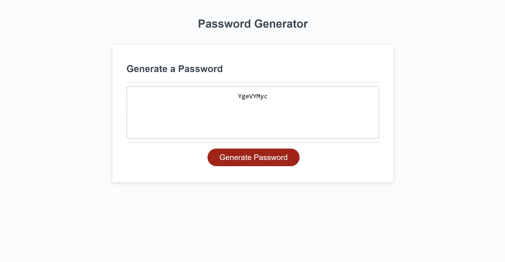

# Password-Generator
This project is a password generator that prompts the user for their preferred character type. You can sleect lowercase, uppercase, numbers and even special characters as well as the length of password. Creating random passwords is a great way for the user to stay safe on the web because it doesn't follow a pattern.

I used javascript to create prompts that let the user select what type of characters to us. These characters were then put into an array and randomized one by one until the password length was met. The password will then be displayed in the main box!

link to deployed URL: https://bram-g.github.io/Password-Generator/

Screenshot: 